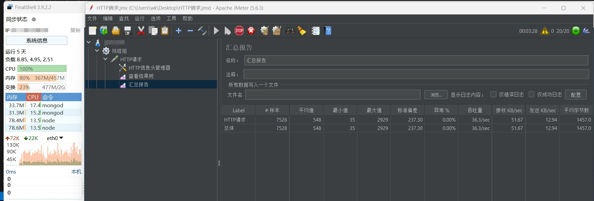
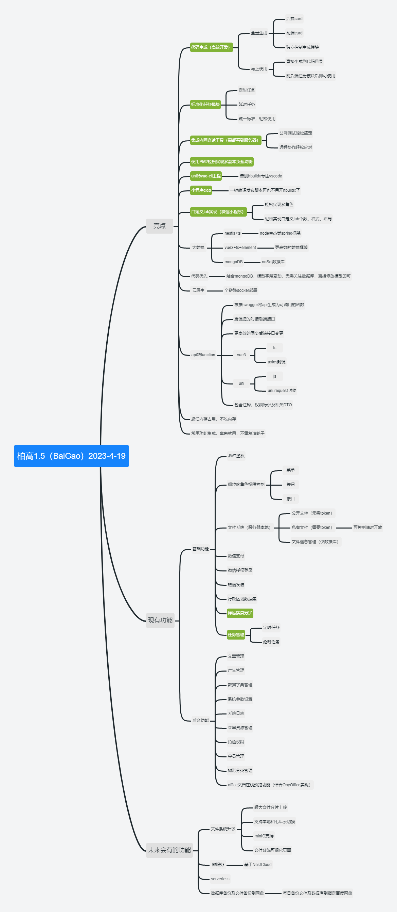

# 柏高（BaiGao）
   nest-admin/nestjs-admin
## 介绍
基于nestJs+mongoDB+vue3+element-plus+uni-app技术栈的大前端后台管理系统；可基于当前系统快速构建toG、toB、toC常见业务系统；经过商业项目验证，可放心食用，如果喜欢，你也可以用你发财的小手点个star，以资鼓励；
## 性能测试（低配性能不缩水）
### 1.机器配置
   核心：1 核

   内存：512 MB 

   交换内存：2048 MB 
### 2.部署
   pm2 
      
      主程双副本集群，自动负载均衡，滚动无缝热更新 

   docker

      1.前端
      2.nginx-manger 
      3.mongodb：主从集群（单副本性能提升三倍左右，无特殊情况，推荐使用单副本） 
      3.redis
### 3.测试结果：mongo双副本主从
   总耗时：4分28秒  10000个请求产生2万条数据 

   最大内存占用：80% 

   最小响应时间：35ms 

   平均响应时间：548ms 

   最大响应时间：2929ms 


### 4.性能参考
   (推荐使用) mongodb单副本【相同环境】 最大内存占用80%

   mysql单副本【相同环境】 最大内存占用83% 
   

## 亮点介绍
### 1.代码生成（高效开发）
   全量生成(后端curd,前端curd),独立控制生成模块
   直接生成到代码目录,前后端注册模块后即可使用
### 2.标准化任务模块
   定时任务\延时任务\统一标准，轻松使用
### 3.uni转vue-cli工程
   告别hbuildx专注vscode
### 4.小程序cicd
   自动编译发布脚本再也不用开hbuildx了
### 集成自定义tab实现（微信小程序）
   轻松实现多角色，自定义tab个数、样式、布局
### 5.大前端生态，node全栈开发
nestJs+ts：一个用于构建高效、可扩展的 Node.js 服务器端应用程序的开发框架。
vue3+ts+element：高效、高性能的前端框架和UI
mongoDB：高性能、分布式noSql数据库
### 6.代码优先
模型字段变动，无需关注数据库，直接修改模型即可
### 7.云原生
全链路docker部署
### 8.api转function,省时、省事、省心、不吵架
根据swagger将api生成为可调用的函数，更便捷的对接后端接口，更高效的同步后端接口变更，包含注释，权限标识及相关DTO;vue3：ts格式，封装axios;uni-app：js格式，封装uni.request
### 9.超低内存占用，不吃内存；
内存占用仅几十到一百多兆
### 10.常用功能集成，拿来就用，不重复造轮子
微信认证、支付；细粒度角色权限；文件管理系统；uni微信小程序基础模板等等；
## 功能清单及规划

## 怎么部署
### 1.安装docker（windows请打开wsl功能，并升级到wsl2，然后再安装docker）,警告！警告！警告！（生产环境请先将数据盘挂载到/var/lib/docker）
### 2.部署mongoDB，主从部署（mongoDB事务必须采用副本集的方式），警告！警告！警告！（mongoDB正式环境请不要暴露到公网，不要使用默认端口27017，数据无价记得定期备份）
```
	# 启动主节点
	docker run -d -p 8017:27017 --name mongodb-primary -v ./primary-data:/data/db mongo:6.0.5 --replSet mongo-rep
	# 启动从节点 （单副本时，无需启动从节点）
	docker run -d -p 8018:27017 --name mongodb-secondary -v ./secondary-data:/data/db mongo:6.0.5 --replSet mongo-rep
	# 进入主节点，并配置主从、用户及数据库等
	docker exec -it mongodb-primary /bin/bash
	mongosh
	# 配置主从节点，此处ip换成自己宿主机的ip
	rs.initiate({_id:"mongo-rep", version:1, members:[{_id:0, host:"172.22.11.118:27017", priority:6}, {_id:1, host:"172.22.11.118:27018", priority:3}]})
   # （推荐）配置【单副本】节点，【仅需部署一个mongodb镜像】即可，此处ip换成自己宿主机的ip
	rs.initiate({_id:"mongo-rep", version:1, members:[{_id:0, host:"172.22.11.118:27017", priority:6}]})
   # 更新使用
   rs.reconfig({_id:"mongo-rep", version:1, members:[{_id:0, host:"172.22.11.118:27017", priority:6}, {_id:1, host:"172.22.11.118:27018", priority:3}]})
   # 重置
   docker去掉 --replSet mongo-rep ，然后进入删除local数据库，use local db.dropDatabase()
   加上--replSet mongo-rep重启,配置主从
	# 创建数据库
	use baigao
	# 创建用户
	db.createUser({user:'baigao',pwd:'123456',roles:[{role:'dbOwner',db:'baigao'}]});
	# 授权用户
	db.auth("baigao","123456");
	# mongoDB部署结束，退出容器即可
	# 使用navcat连接到数据库，使用/backend/dbbak/baigao.js进行数据库恢复即可使用,默认账号：baigai 密码：123456
```
### 3.部署redis
```
	# 创建redis.conf，内容如下
	requirepass 123456
	# 部署docker
	docker run --name=redis --volume=./redis.conf:/usr/local/etc/redis/redis.conf --volume=./data:/data --workdir=/data -p 6379:6379 --restart=no --detach=true redis redis-server /usr/local/etc/redis/redis.conf --appendonly yes
```
### 4.部署服务端到服务器
```
0.前置条件：
	nodejs：v18.17.0
	git：version 2.39.1
	Docker: version 24.0.1, build 6802122
	Docker Compose： version v2.18.1

1.创建文件夹：file用于存储数据库文件
	mkdir -p file/private
	mkdir -p file/public

2.创建docker-compose.yml
version: '3.8'
services:
    app:
       image: 'youProject:backend'
       restart: unless-stopped
       ports:
          - '3001:3001'
       volumes:
          - /var/lib/docker/workspace/backend/file/private:/dist/private
          - /var/lib/docker/workspace/backend/file/public:/dist/public

3.创建并运行backend-build-docker.sh

echo '-----------------------delete project-----------------------------'
#rm -ivrf ./baigao
echo '-----------------------clone project------------------------------'
git clone -b project/youProject git@github.com:wangke1993/baigao.git
echo '-----------------------build backend------------------------------'
cd baigao/backend
# 第一次拉取代码后，后续均用pull拉取最新代码
# git pull -f
# 没有pnpm 执行 下面一行命令
# npm install -g pnpm
pnpm i
pnpm build
# 注意！注意！：这里的env请存储到服务器，不要把生成环境相关密钥放到git仓库
cp docker/.env dist
cp -r node_modules dist
# https://blog.csdn.net/qq_41953872/article/details/124296209 滚动更新实践
echo '----------------------build docker image-------------------------'
docker build -t youProject:backend -f ./docker/Dockerfile ./
cd ../../
docker-compose -p youProject-backend up -d
```

### 5.部署前端到服务器
```
1.创建docker-compose.yml
version: '3.8'
services:
    app:
       image: 'baigao:frontend'
       restart: unless-stopped
       ports:
          - '88:80'
          - '89:81'
2.创建并运行fontend-build-docker.sh
echo '-----------------------delete project-----------------------------'
# rm -ivrf ./baogao
echo '-----------------------clone project------------------------------'
git clone -b project/youProject git@github.com:wangke1993/baigao.git
echo '-----------------------build front--------------------------------'
cd baogao/frontend
# 第一次拉取代码后，后续均用pull拉取最新代码
# git pull -f
yarn
yarn build-only
echo '----------------------build docker image-------------------------'
docker build -t youProject:frontend -f ./docker/Dockerfile ./
echo '----------------------deploy pod---------------------------------'
cd ../../
docker-compose -p youProject-frontend up -d
```
### 6.部署onlyOffice(可选，会占用较大硬盘空间，请提前规划好存储方案)
```
docker run --name=onlyoffice -i -t -d -p 666:80 -v ./logs:/var/log/onlyoffice -v ./data:/var/www/onlyoffice/Data onlyoffice/documentserver
关闭token验证
进入容器：
docker exec -it onlyoffice /bin/bash
cd /etc/onlyoffice/documentserver
sed -i 's/true/false/g' local.json
supervisorctl restart all
```
### 7.部署nginx-proxy-manager用户域名映射及ssl部署（可选）
```
1.创建docker-compose.yml
version: '3.8'
services:
    app:
       image: 'jc21/nginx-proxy-manager:latest' // 汉化：chishin/nginx-proxy-manager-zh:latest
       restart: unless-stopped
       ports:
          - '80:80'
          - '81:81'
          - '443:443'
       volumes:
          - ./data:/data
          - ./letsencrypt:/etc/letsencrypt
2.docker-compose up -d
```

### 8.如何给容器固定ip
```
// 清理无用的网桥
docker network prune

// 创建名为FACAI的网络
docker network create --subnet 172.18.0.0/16 FACAI

// docker-compose
services:
	networks:
         mynetwork:
            ipv4_address: 172.18.0.2
networks:
  mynetwork:
    external:
      name: FACAI
```
### 9.负载均衡
使用pm2进行多副本部署即可
创建ecosystem.config.js
```
module.exports = {
  /**
   * Application configuration section
   * http://pm2.keymetrics.io/docs/usage/application-declaration/
   */
  apps: [
    {
      name: "BG-server",
      script: "dist/index.js",
      // 副本数量
      instances: 2, 
      exec_mode: 'cluster',
      // 这里env，跟.env文件有冲突，使用pm2部署的时候需要在这里单独配置
      env: { env: 'prod' },
    },
  ],
};
```
启动：
```
// 第一次启动
pm2 start ecosystem.config.js
// 后续代码更新。注意！！！注意！！！注意！！！
// 1.需变更backend的package.json版本号；
// 2.两个副本以上即可实现滚动更新；
pm2 restart ecosystem.config.js
```
## 本机免密登录到服务器
   ```
   cat id_rsa.pub >> authorized_keys
   ```
## 工具推荐
源切换：nrm \
node版本管理：nvm
nvm安装出现网络问题怎么办
   1.去掉install.sh中的install_nvm_from_git，随便输出点什么
   2.手动下载github的zip，解压到.nvm中
   3.运行install.sh
   4.source /root/.bashrc
   5.设置nvm默认版本nvm alias default 18.14.2
yarn中有依赖一直在下载问题
   在.yarnrc中添加如下代码即可
   ```
   registry "https://registry.npm.taobao.org"

sass_binary_site "https://npm.taobao.org/mirrors/node-sass/"
phantomjs_cdnurl "http://cnpmjs.org/downloads"
electron_mirror "https://npm.taobao.org/mirrors/electron/"
sqlite3_binary_host_mirror "https://foxgis.oss-cn-shanghai.aliyuncs.com/"
profiler_binary_host_mirror "https://npm.taobao.org/mirrors/node-inspector/"
chromedriver_cdnurl "https://cdn.npm.taobao.org/dist/chromedriver"
   ```
   
## 解决二级代理日志ip问题
   1.一级代理中server中新增如下配置，nginx-proxy-manager直接配置在高级->自定义配置即可
   ```
   proxy_set_header X-Forwarded-For $proxy_add_x_forwarded_for;
   ```
   2.程序代理中http下新增如下配置
   ```
   # 172.18.0.2为一级代理的ip
   set_real_ip_from 172.18.0.2;
   real_ip_header X-Forwarded-For;
   ```
## 版本说明
当前版本：1.5.0 \
发布时间：2024-4-19 \
版本说明：
   后端：代码生成（基于ejs，直接生成到开发工具中，立即见效，改改就用），优化任务管理模块（延时任务/定时任务/任务分发），内网穿透（networkTools）,系统配置界面自定义 \
   小程序：自定义tab栏 \
关键词：nestJs、vue3、ts、mongoDB、uni-app、element-plus、微信生态、大前端、云原生、nestJs代码生成、nestJs低代码

## 技术交流，进群请加微信，有问题直接群里面问吧，暂时没空写文档
手机号（微信同号）：17612702450 \
加微请备注：柏高

## 接【项目合作】、【系统定制开发】
手机号（微信同号）：17612702450 \
加微请备注：开发

## 尾巴
挑刺使人进步，欢迎大佬们多提意见、建议，多挑刺，多找茬；
